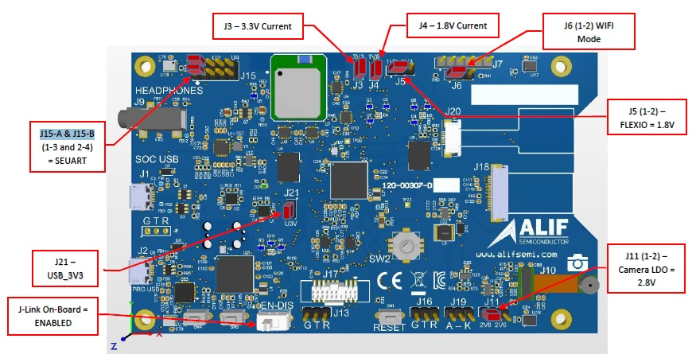
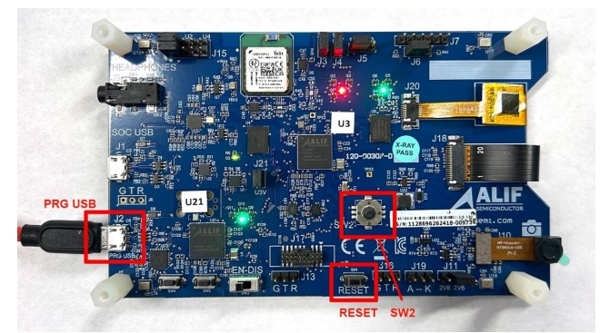

# Overview of AK-E7-AIML HW:D3

The following picture shows the default board configuration.

## On-board Debug Adapter

The board provides an on-board JLink debug-adapter with COM port routed to UART4. To enable the UART output configure the J15-A & J15-B to position U4.

## Links

- [Ensemble AppKit Gen 2](https://alifsemi.com/support/kits/ai-ml-appkit/)
