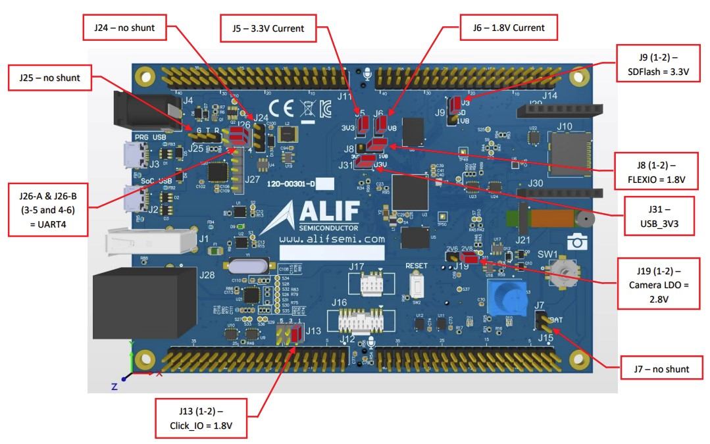
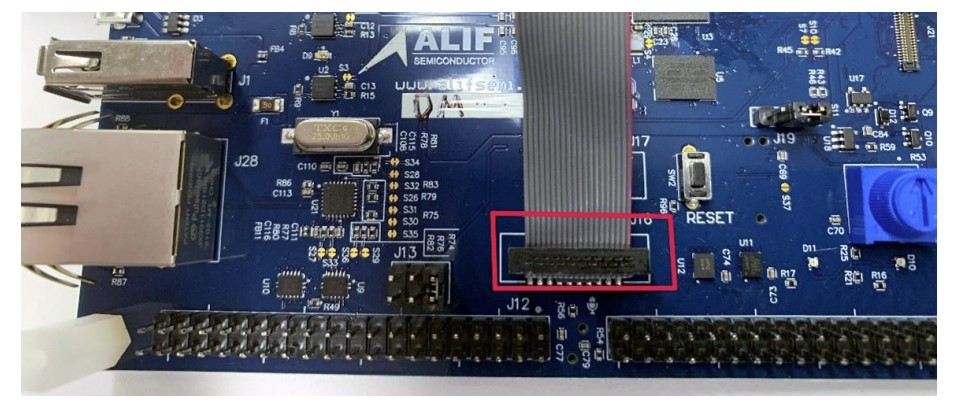

# Overview of DK-E7 HW:D2

The following picture shows the default board configuration.

## Connecting a JTAG Debugger

The board provides Cortex Debug connectors (J16 and J17) to connect an external JTAG Debug Probe.
The picture below shows a Segger J-Link with 19-pin Cortex-M adapter connected to J16 on the DevKit.

## Links

- [Ensemble DevKit Gen 2](https://alifsemi.com/support/kits/ensemble-devkit-gen2/)
